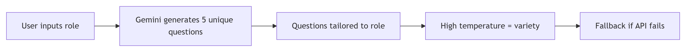

# 🎯 AI Job Interview Coach
## Author: Imtiaz Ahmed Adar [LinkedIn](https://www.linkedin.com/in/imtiaz-ahmed-adar)

[](https://www.python.org/)
[](https://streamlit.io/)
[](https://makersuite.google.com/)
[](LICENSE)

**Master your interview skills with AI-powered feedback, voice recognition, and personalized coaching**

[🚀 Live Demo](https://tinyurl.com/AiJobInterviewCoachImtiazAdar) • [📧 Contact](mailto:imtiazadarofficial@gmail.com)

---

## 🌟 Overview

AI Job Interview Coach is an intelligent, interactive platform that helps job seekers prepare for interviews through realistic simulations, real-time AI feedback, and multi-modal interaction (text + voice). Built with Google's Gemini AI and Streamlit, it provides **completely unique interviews every time** - no two sessions are the same!

### Why This Project Stands Out

| Feature | Impact |
|---------|--------|
| **Dynamic Questions** | Every interview generates fresh, role-specific questions |
| **Voice + Text Input** | Practice speaking answers naturally |
| **Instant AI Feedback** | Get detailed scoring and improvement suggestions |
| **Visual Analytics** | See your strengths and weaknesses visually |
| **Downloadable Reports** | Track your progress over time |

---

## ✨ Key Features

### 🎯 Smart Interview Simulation
- **Dynamic Question Generation**: Creates UNIQUE questions for your specific role
- **5 Question Format**: Covers motivation, technical skills, problem-solving, teamwork, and goals
- **Role Intelligence**: Tailors questions to Animator, Engineer, Marketing, Sales, and more

### 🎤 Multi-Modal Input
- **Voice Recording**: Speak your answers naturally
- **Speech-to-Text**: Automatic transcription of spoken responses
- **Text Input**: Traditional typing option
- **Real-time Processing**: Instant feedback on your answers

### 📊 Intelligent Scoring System
- **5 Key Metrics**: Communication, Confidence, Relevance, Problem Solving, Professionalism
- **Question-Level Scoring**: See performance on each specific question
- **Visual Dashboards**: Interactive charts and graphs
- **STAR Method Analysis**: Evaluates structured responses

### 📝 Comprehensive Feedback
- **Strengths Analysis**: What you did well
- **Improvement Areas**: Specific, actionable suggestions
- **Role-Specific Advice**: Tailored to your target position
- **Example Answers**: Learn from model responses

### 🎨 Features for Recruiters & Candidates
- **Progress Tracking**: Downloadable reports with timestamps
- **Multiple Attempts**: Practice as many times as needed
- **No Account Required**: Instant access with API key
- **Free to Use**: Gemini API free tier (60 requests/min)

---

## 🛠️ Technology Stack

| Component | Technology | Purpose |
|-----------|------------|---------|
| **Frontend** | Streamlit | Interactive web UI |
| **AI Engine** | Google Gemini 2.0 Flash | Question generation & evaluation |
| **Voice Recognition** | SpeechRecognition + Google Speech API | Speech-to-text conversion |
| **Text-to-Speech** | gTTS (Google Text-to-Speech) | Audio feedback generation |
| **Data Visualization** | Matplotlib, Pandas | Performance charts |
| **Audio Processing** | Streamlit Audio Input | Voice capture |

---

## 📋 Prerequisites

- Python 3.11 or higher
- Google Gemini API Key ([Get Free Key](https://makersuite.google.com/app/apikey))
- Microphone (for voice input feature)
- Internet connection

---

## 🔧 Installation

**1. Create Virtual Environment**
```
# Windows
python -m venv venv
venv\Scripts\activate
```
```
# Mac/Linux
python3 -m venv venv
source venv/bin/activate
```
**2. Install Dependencies**
```
pip install -r requirements.txt
```
**3. Set Up Environment Variables**
Create a .env file in the project root:
```
env
GEMINI_API_KEY=your_gemini_api_key_here
```
**4. Run the Application**
```
streamlit run app.py
```


# 🎮 Usage Guide
**Quick Start (30 seconds)**  
Enter your job role (e.g., "Software Engineer", "Marketing Manager", "Graphic Designer")

**Click "Start Interview"**

**Answer 5 questions (type or speak)**

**Get instant AI feedback with scores and recommendations**

**Voice Input Instructions**  
Click the microphone icon 🎤

**Speak clearly for 5-15 seconds**

**Wait for automatic transcription**

**Review and submit your answer**

**Understanding Your Scores**
Score Range	Meaning	Action  
8-10	Excellent	Keep practicing, you're ready!  
6-7	Good	Refine specific areas  
4-5	Needs Work	Review feedback carefully  
1-3	Beginner	Practice fundamentals  

**Question Types (Always Dynamic)**  
Your interview will include questions about:

**Motivation: Why this role/company?**

**Technical Skills: Relevant expertise**

**Problem Solving: Handling challenges**

**Teamwork: Collaboration examples**

**Future Goals: Career aspirations**

# 🧠 How It Works
Question Generation Flow


# Scoring Algorithm
Score Components:  
├── Length (20%): Detailed answers score higher  
├── Keywords (30%): Role-specific terms  
├── Structure (25%): Clear organization  
├── Examples (25%): Concrete experiences  
└── Final Score: Weighted combination  

